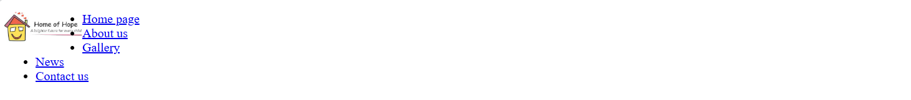
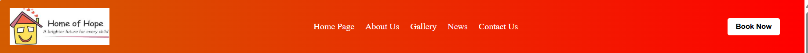
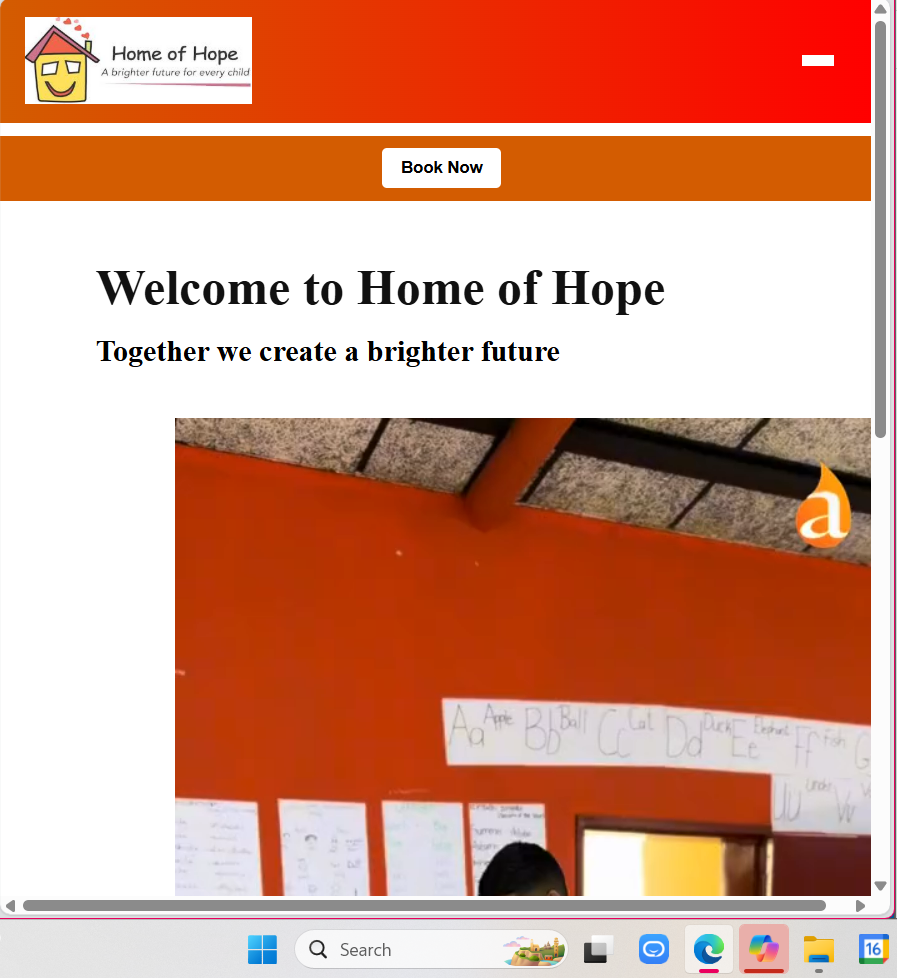
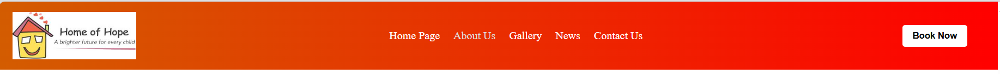
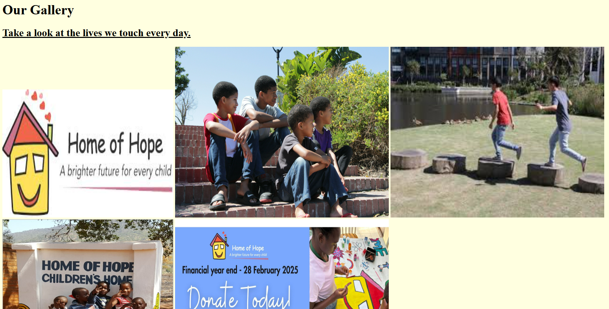
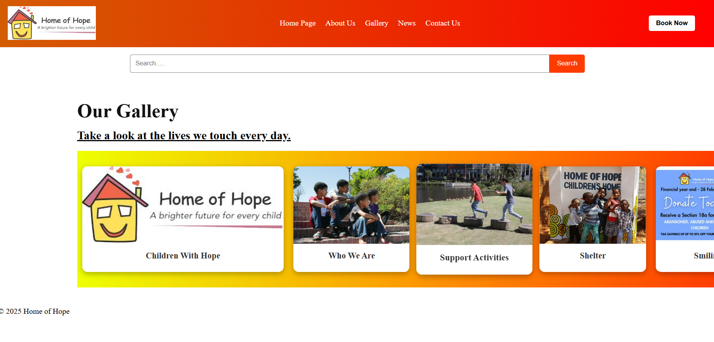
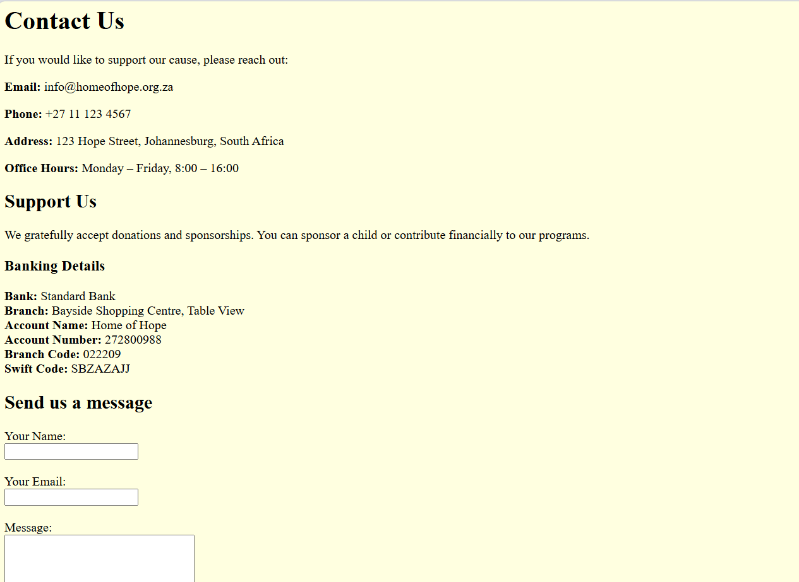
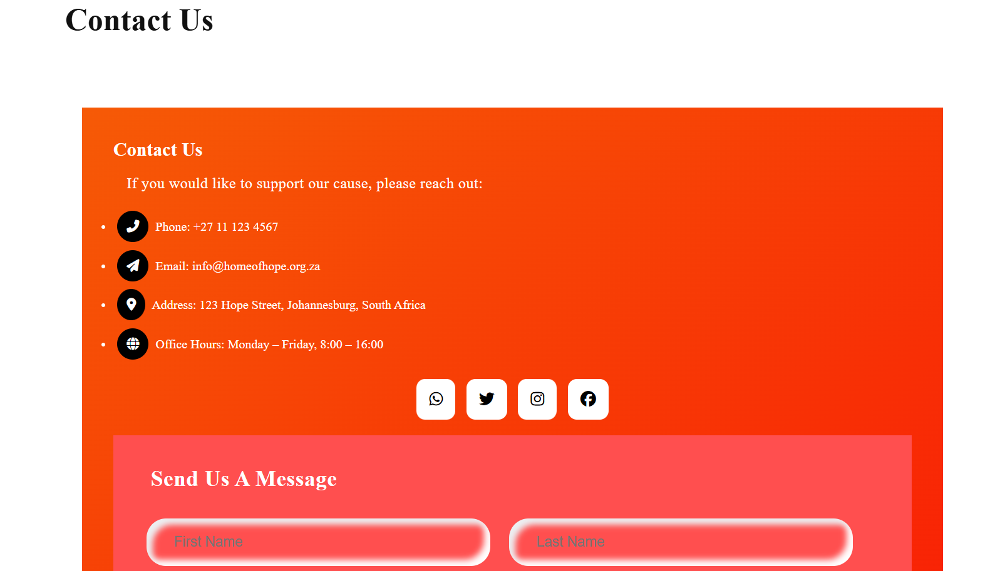

# Home of Hope Website

Welcome to the official repository for the **Home of Hope** website—a digital platform designed to support and promote the mission of empowering children through education and care.

## Project Overview

This website was created to provide a warm, informative, and accessible online presence for the Home of Hope initiative. It includes key sections such as:

- **Home Page** – Introduction and mission statement
- **About Us** – Organizational background
- **Gallery** – Visual showcase of activities and facilities
- **News** – Updates and announcements
- **Contact Us** – Donation details and communication form

## Technologies Used
- HTML
- CSS5
- Markdown

The newer version of the site includes responsive design, styled components, and improved layout using CSS.

## Features

- Responsive navigation bar with hamburger menu
- Search bar for quick access
- Contact form with styled input fields
-  Clean, accessible layout with visual hierarchy

## ✨ Part 2: September 2025 Updates & Improvements

The website has undergone a major visual and structural upgrade, transforming it from a basic HTML layout into a vibrant, responsive, and emotionally engaging platform. Here's a breakdown of the enhancements:

### Visual Design & Branding

- Gradient header with warm tones for emotional impact
- Consistent logo placement and tagline messaging
- Clear branding: _“A brighter future for every child”_ and _“Helping the homeless regain dignity”_

### Responsive Navigation

- Mobile-friendly hamburger menu using pure HTML and CSS
- “Book Now” button remains visible and accessible on all screen sizes

### Gallery Enhancements

- Horizontal scrollable gallery with interactive cards
- Grid collage layout showcasing children, activities, and donation prompts
- Visual storytelling through curated images and banners

### News & Events

- Latest news section featuring:
  - Fundraising Event 2025
  - New Shelter Opening
- Event promotion for “Blanc Et Bloom” Ladies Lunch with full details and elegant flyer design

### Contact & Support

- Styled contact section with icons for phone, email, location, and hours
- Social media icons for engagement
- Donation section with full banking details and sponsorship messaging

### Forms & Accessibility

- Message form with styled input fields for name, email, and message
- Accessibility improvements:
  - Alt text for images
  - Responsive layout
  - Clear visual hierarchy

## Navigation Bar
- **Before**
 
- **After**
 

**Hamburger Menu**
 

**Active Tab Styling**
 

## Gallery Page
- **Before**
 

- **After**
 

## Contact us 
- **Before**
 
 

- **After**
 
 

## References
- W3Schools CSS(https://www.w3schools.com/css/default.asp)

